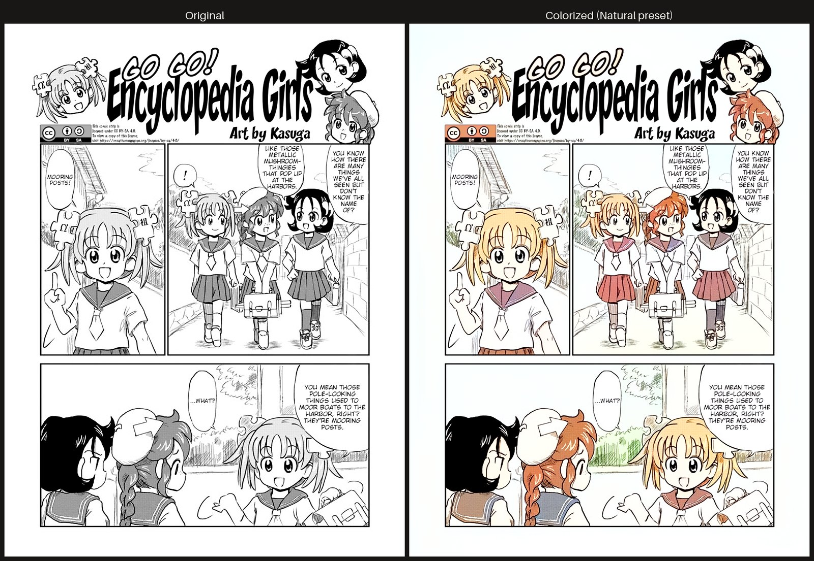
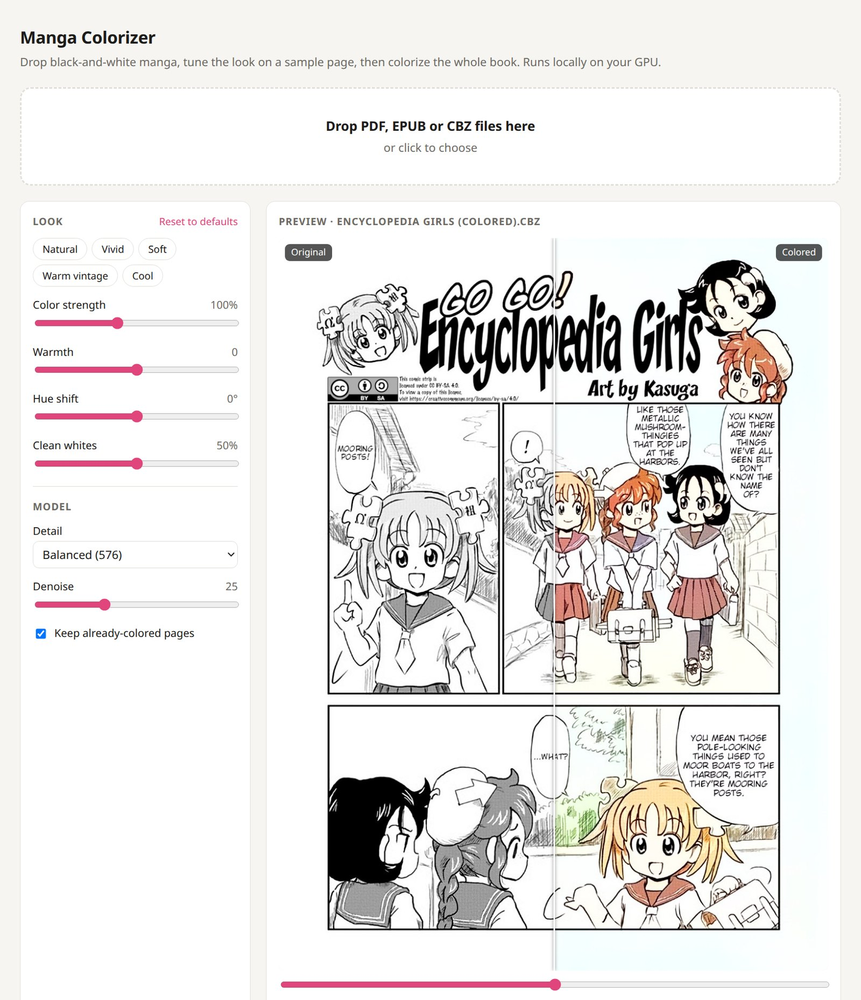
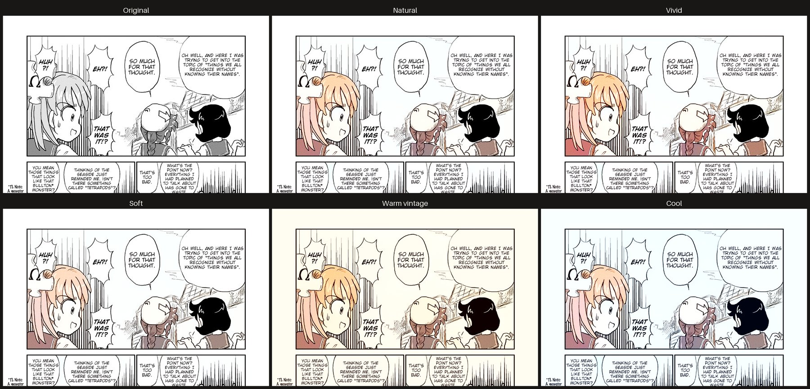
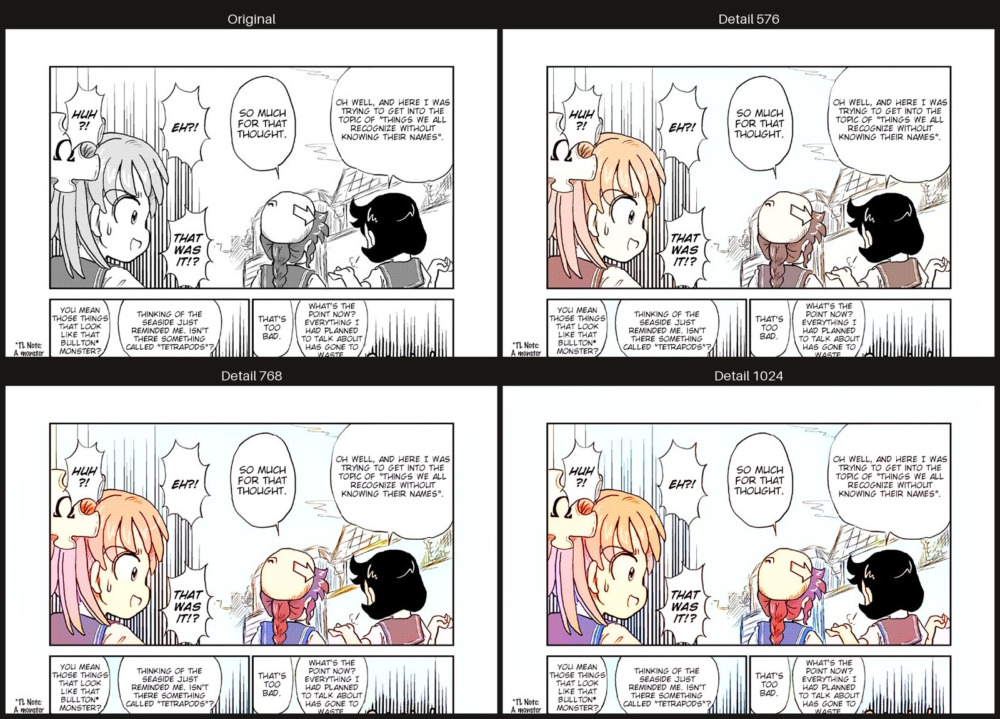
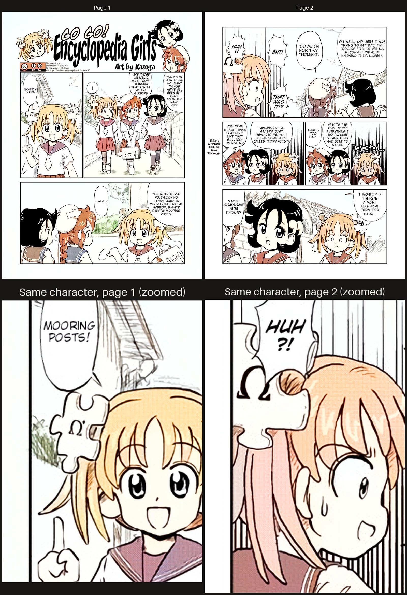
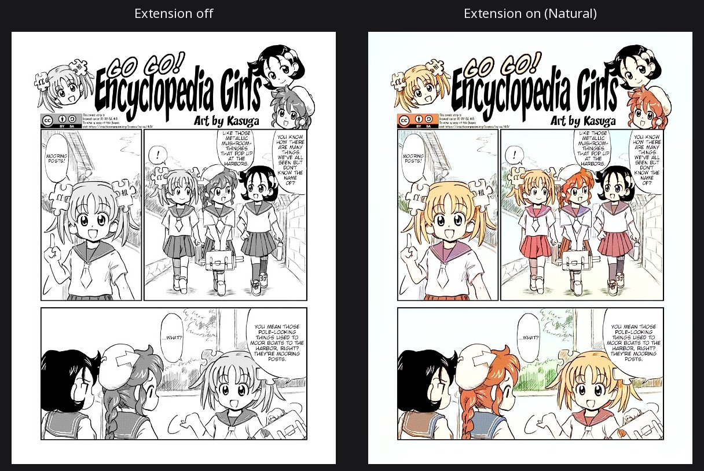
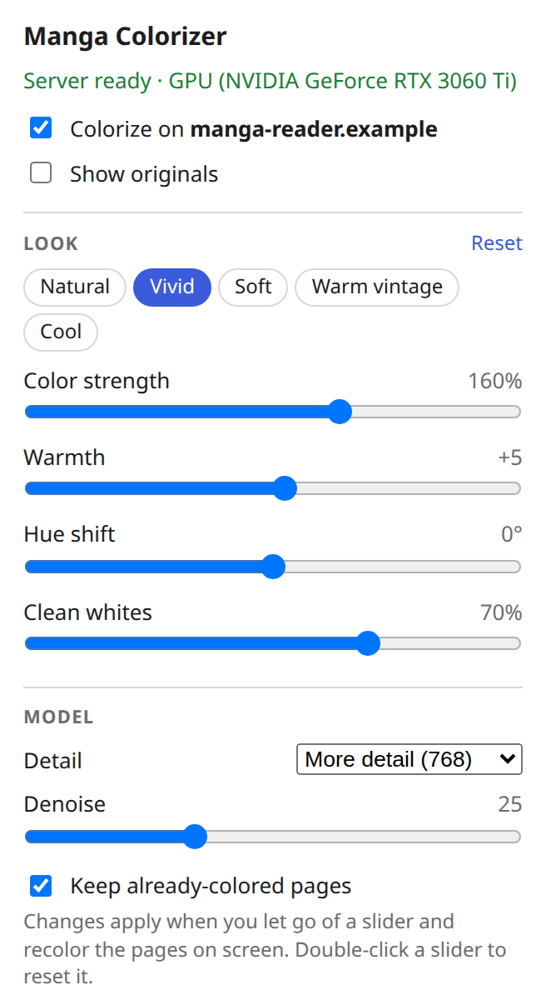

# Manga Colorizer

**Drop in a black-and-white manga, get it back in color.** A self-hosted web app that AI-colors whole books (PDF, EPUB or CBZ) and gives you back the same format. It runs on your own GPU, with no account, no cloud and no uploads to anyone.

[](https://github.com/FlamboyantEntertainment/manga-colorizer/actions/workflows/ci.yml)
[](LICENSE)




<p align="center"></p>

## Features

- **Whole books in, whole books out.** Supports PDF, EPUB and CBZ. EPUBs stay valid EPUBs, and page order and file names are preserved.
- **Sharp linework.** The AI colors a small copy of each page, then only the color is transferred onto your original full-resolution page. Lines and screentone stay as crisp as the source.
- **Live preview.** Tune the look on any page of the book with a before/after slider before you commit.
- **Tone controls.** Color strength, warmth, hue shift and "clean whites" (removes the tint on paper and speech bubbles), plus presets.
- **Browser extension.** Colors manga pages in place as you read on a website, with the same presets and sliders as the web UI.
- **Smart skipping.** Already-colored pages such as covers are left alone, and so are small images like icons.
- **Light on hardware.** Runs on 8 GB NVIDIA GPUs at about 0.5 s per page, and also works on CPU (about 10–20 s per page, so a 200-page volume takes about an hour).

## Quick start

You need [Docker](https://docs.docker.com/get-docker/). Then pick one:

### NVIDIA GPU: Windows (Docker Desktop)

```
docker run -d --gpus all -p 7860:7860 -v manga-models:/models --name manga-colorizer --restart unless-stopped ghcr.io/flamboyantentertainment/manga-colorizer:latest
```

### NVIDIA GPU: Linux

First, one-time setup: install the [NVIDIA Container Toolkit](https://docs.nvidia.com/datacenter/cloud-native/container-toolkit/latest/install-guide.html) so Docker can use your GPU. Then run the same command:

```
docker run -d --gpus all -p 7860:7860 -v manga-models:/models --name manga-colorizer --restart unless-stopped ghcr.io/flamboyantentertainment/manga-colorizer:latest
```

### No NVIDIA GPU (any computer, including Mac)

```
docker run -d -p 7860:7860 -v manga-models:/models --name manga-colorizer --restart unless-stopped ghcr.io/flamboyantentertainment/manga-colorizer:cpu
```

Then open **http://localhost:7860**. On the first start the app downloads the AI model (about 130 MB), and the status line at the top tells you when it's ready.

<details>
<summary>Docker Compose</summary>

```
curl -O https://raw.githubusercontent.com/FlamboyantEntertainment/manga-colorizer/main/docker-compose.yml
docker compose up -d
```

For CPU only, edit the file first: use the `:cpu` tag and delete the `deploy:` section.
</details>

**Update:** `docker pull ghcr.io/flamboyantentertainment/manga-colorizer:latest`, then remove the container (`docker rm -f manga-colorizer`) and run the command again. The downloaded model is kept.

## How to use

1. **Drop** one or more books onto the page.
2. **Tune** the look. The app picks a representative page (it skips covers, blank pages and title pages). Use Prev/Next to check other pages. Drag the slider in the middle of the preview to compare before and after.
3. **Colorize**, then **Download** when it's done. The file is named `<name> (colored).<ext>`.

### Settings

| Setting | What it does |
|---|---|
| Presets | Natural, Vivid, Soft, Warm vintage, Cool |
| Color strength | 0% = grayscale, 100% = the AI's own colors, up to 250% |
| Warmth | Shifts colors toward yellow/red (warm) or blue (cool) |
| Hue shift | Rotates all colors, for when the whole palette feels off |
| Clean whites | Removes the color tint the AI leaves on paper and speech bubbles |
| Detail | The resolution the AI works at. 576 is what it was trained on and usually looks best |
| Denoise | Cleans JPEG noise before coloring. Raise it for noisy scans; use 0 for clean digital releases |

**Reset to defaults** restores everything; double-click any slider to reset just that one.

**Presets** on the same page:



**Detail**: higher values give small areas such as collars and braids their own color, at the cost of speed:



## What to expect

This uses [manga-colorization-v2](https://github.com/qweasdd/manga-colorization-v2), a fast, lightweight model. Results are pleasant, soft, anime-style color, not hand-colored quality. Each page is colored on its own, so a character's hair or clothes may change color between pages. The tone controls help you get a consistent overall look.

A full four-page story with the default settings:


**Page-to-page consistency**, up close: the same girl is golden blonde on page 1, but in page 2's big close-up her hair turns peach with pink strands. In page 2's smaller panels she's blonde again, so colors can drift even within a page, most often in large close-ups.



## Troubleshooting

- **The status line says "CPU" but I have an NVIDIA GPU.** Make sure you used `--gpus all`. On Linux, install the NVIDIA Container Toolkit. Check with `docker run --rm --gpus all ubuntu nvidia-smi`.
- **The model failed to download.** The first start needs internet access to GitHub. Restart the container to retry.
- **Port 7860 is already in use.** Change the first number, for example `-p 8080:7860`, then open http://localhost:8080.

## Run without Docker

Needs [uv](https://docs.astral.sh/uv/) and Python 3.12 (uv installs it for you):

```
git clone https://github.com/FlamboyantEntertainment/manga-colorizer.git
cd manga-colorizer
./run.sh
```

For CPU-only machines, change the PyTorch index URL in `pyproject.toml` to `https://download.pytorch.org/whl/cpu` first. Run the tests with `uv run pytest` and `node --test tests/js/*.test.mjs`.

## Browser extension

Colorizes manga pages in place while you read on a website. It uses this server at http://127.0.0.1:7860, so keep it running (Docker or `./run.sh`).

1. Open `brave://extensions` (or `chrome://extensions`), turn on **Developer mode**, click **Load unpacked** and pick the `extension/` folder.
2. Pin the extension, open a chapter, click the icon and tick **Colorize on <site>**. The site is remembered.
3. Pages are colored a little before they scroll into view. The popup has the same presets and sliders as the web UI (color strength, warmth, hue shift, clean whites, detail, denoise, keep already-colored pages); changing them recolors the pages on screen. **Show originals** flips back to black and white.



### Popup settings



The popup carries the same controls as the web UI, and they apply to every site you've turned on:

| Control | What it does |
|---|---|
| Presets | Natural, Vivid, Soft, Warm vintage, Cool. The chip for the current look is highlighted. |
| Color strength, Warmth, Hue shift, Clean whites | Fine-tune the look. |
| Detail | The resolution the AI works at: Balanced (576), More detail (768) or Max (1024, slower). |
| Denoise | Cleans JPEG noise before coloring. Raise it for noisy scans; use 0 for clean digital releases. |
| Keep already-colored pages | Leaves pages that are already in color alone. |
| Reset | Puts everything back to the defaults. Double-click a slider to reset just that one. |

Pages recolor when you let go of a slider. Colored pages are cached per setting combination, so switching back to a look you just used is instant.

<br clear="right">

Colored pages live only in memory; nothing is saved. Pages drawn into a `<canvas>` or used as CSS backgrounds aren't supported.

To try it locally: `.venv/bin/python tests/extension-page/make_page.py`, then `.venv/bin/python -m http.server 8765 -d tests/extension-page`, and open http://127.0.0.1:8765/.

## Credits and license

- The colorization model and network code are [manga-colorization-v2](https://github.com/qweasdd/manga-colorization-v2) by qweasdd. The weights are downloaded on first run from the mirror published by [manga-image-translator](https://github.com/zyddnys/manga-image-translator); they are not included in this repository or the Docker images.
- The network code in `mc2/` was adapted from manga-image-translator (GPL-3.0).
- This project is licensed under the [GNU GPL v3.0](LICENSE).
- The demo images in `docs/` (including the extension screenshots) are colorized versions of [*Go Go! Encyclopedia Girls*](https://commons.wikimedia.org/wiki/File:Go_Go!_Encyclopedia_Girls_-_English_01.png) (pages 1–4), art by Kasuga, English version by Masatami, licensed [CC BY-SA 4.0](https://creativecommons.org/licenses/by-sa/4.0/). The colorized images in `docs/` are shared under the same license.

Please only colorize books you have the right to use, and respect the creators whose work you enjoy.
